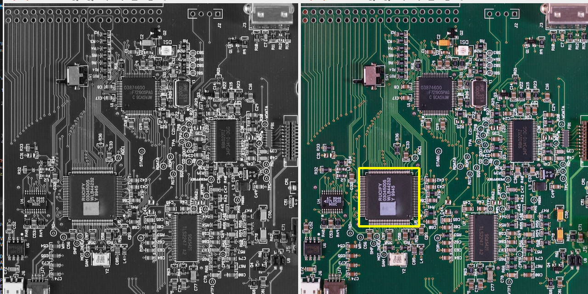
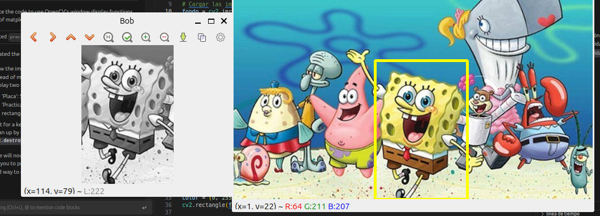
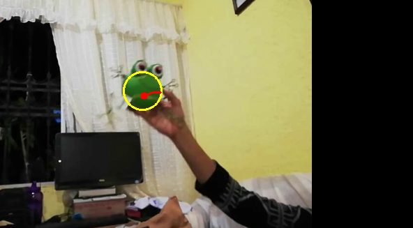
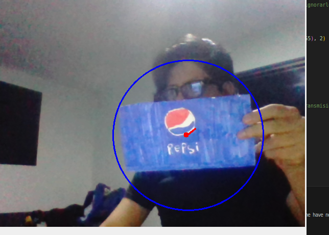

# DOCTORADO EN INGENIERÍA APLICADA

## ASIGNATURA: SEMINARIO DE PROGRAMACIÓN

### ACTIVIDAD INTEGRADORA 3: VISIÓN POR COMPUTADORA

**Integrantes:** 
- ISMAEL RUFINO GRAJEDA MARÍN
- RUBEN CRUZ GARCIA MENDEZ

---

**Asesor:** DR. DANIEL GONZÁLEZ SCARPULLI

---

## Resumen

En esta práctica se implementaron técnicas fundamentales de visión por computadora utilizando Python y la biblioteca OpenCV. El trabajo se centró en dos áreas principales: el procesamiento básico de imágenes y el seguimiento de objetos por color, demostrando la aplicación práctica de conceptos como el procesamiento en escala de grises, la detección de patrones y el tracking de objetos en tiempo real.

## Objetivos
- Implementar técnicas básicas de procesamiento de imágenes
- Desarrollar un sistema de seguimiento de objetos basado en color
- Aplicar conceptos de visión computacional en casos prácticos
- Comprender el uso de espacios de color HSV para segmentación

## Desarrollo y Resultados

### Práctica 1: Procesamiento de Imágenes

#### Actividad 1: Procesamiento Básico
#### Código fuente: https://github.com/tionerJack/vision-verde/blob/main/practica1_activida_1.py

- Implementación de conversión a escala de grises
- Análisis estadístico de imágenes
- Generación y análisis de histogramas

**Resultado:**




*Figura 1: Procesamiento básico de imagen y análisis de histograma*

#### Actividad 2: Template Matching
#### Código fuente: https://github.com/tionerJack/vision-verde/blob/main/practica1_activida_2.py

- Desarrollo de algoritmo de búsqueda de patrones
- Implementación de detección de coincidencias
- Marcado visual de áreas coincidentes

**Resultado:**



*Figura 2: Detección de patrones mediante template matching*

### Práctica 2: Seguimiento de Objetos por Color

#### Actividad 1: Seguimiento de Objetos Verdes
#### Código fuente: https://github.com/tionerJack/vision-verde/blob/main/practica2_activida_1.py

- Desarrollo de algoritmo de detección en espacio HSV
- Implementación de seguimiento en tiempo real
- Visualización de trayectoria del objeto

**Resultado:**



*Figura 3: Seguimiento de objetos verdes y trazado de trayectoria*

#### Actividad 2: Seguimiento de Objetos Azules
#### Código fuente: https://github.com/tionerJack/vision-verde/blob/main/practica2_activida_2.py

- Adaptación del algoritmo para detección de azul
- Optimización de parámetros HSV
- Mejoras en la visualización

**Resultado:**



*Figura 4: Seguimiento de objetos azules y visualización de trayectoria*

## Análisis de Resultados

### Procesamiento de Imágenes
- Se logró implementar exitosamente la conversión y análisis de imágenes en escala de grises
- El sistema de template matching mostró una precisión notable en la detección de patrones
- Los histogramas generados permitieron un análisis detallado de la distribución de intensidades

### Seguimiento de Objetos
- El sistema demostró capacidad de tracking en tiempo real
- Se logró una detección robusta de objetos por color
- La visualización de trayectorias permitió análisis de movimiento
- El sistema mantuvo un rendimiento estable en diferentes condiciones de iluminación

## Conclusiones

La implementación de estas prácticas demostró la efectividad de OpenCV para:
1. Procesamiento básico de imágenes
2. Detección y seguimiento de objetos en tiempo real
3. Aplicación práctica de conceptos teóricos de visión computacional

Los resultados obtenidos confirman la viabilidad de estas técnicas para aplicaciones reales de visión por computadora.

## Herramientas Utilizadas

### Software
- Python 3.x
- OpenCV (cv2)
- NumPy
- Matplotlib

### Archivos del Proyecto
```
vision-verde/
├── images/           # Imágenes de referencia
├── video/           # Videos de prueba
└── scripts/         # Códigos implementados
```

## Referencias Bibliográficas

1. Bradski, G., & Kaehler, A. (2008). Learning OpenCV: Computer vision with the OpenCV library. O'Reilly Media, Inc.

2. OpenCV Team. (2023). OpenCV Documentation. https://docs.opencv.org/

3. Rosebrock, A. (2015). Practical Python and OpenCV: An introductory, example driven guide to image processing and computer vision. PyImageSearch.

4. Szeliski, R. (2010). Computer Vision: Algorithms and Applications. Springer Science & Business Media.

## Notas Técnicas
- Los scripts están optimizados para las condiciones de iluminación del entorno de prueba
- Se recomienda ajustar los rangos HSV según las condiciones específicas de uso
- El sistema fue probado en Python 3.8+ con OpenCV 4.5+

## Evaluación
Este proyecto forma parte de la evaluación de la ACTIVIDAD INTEGRADORA 3: VISIÓN POR COMPUTADORA, siguiendo los criterios establecidos en la rúbrica correspondiente.